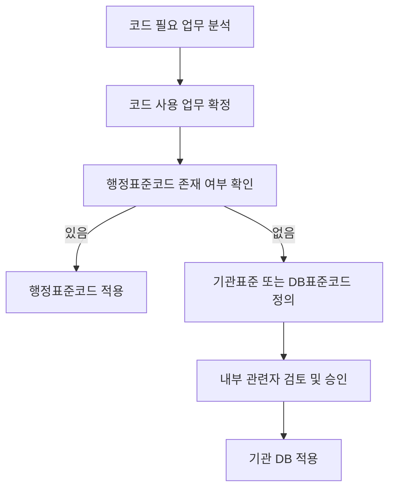

# 공공표준용어 생성을 위한 표준코드 기준 추출본

- 원본: 공공데이터베이스 표준화 관리 매뉴얼 2026.4
- 추출 범위: 원문 인쇄 기준 148p~151p
- 목적: Codex 또는 Claude Code에서 공공표준용어 생성 시 `표준코드` 적용 여부를 판단하고, 코드명/코드값/코드값 의미/데이터타입/데이터길이를 정의하는 기준으로 사용
- 핵심 범위: 표준코드 개요, 표준코드 관리항목, 표준코드 정의 절차, 신규코드 적용 절차, 표준코드 관리항목 정의 기준

---

## 1. Codex 사용 지침

Codex가 공공표준용어 또는 DB 컬럼 후보를 생성할 때, 값이 정해진 목록 또는 분류값으로 관리되는 항목은 아래 기준으로 `표준코드` 적용 여부를 판단한다.

1. 입력된 컬럼명, 속성명, 용어명이 특정 값 목록을 갖는지 확인한다.
   - 예: 성별, 기관, 국가, 상태, 구분, 유형, 여부, 코드
2. 해당 값 목록이 2개 이상의 데이터베이스 또는 시스템에서 공통으로 사용될 가능성이 있는지 확인한다.
3. 행정표준코드가 존재하는지 우선 확인한다.
   - 행정표준코드가 있으면 신규 코드를 만들지 말고 행정표준코드 적용을 우선한다.
4. 행정표준코드에 없고 기관 또는 DB 업무 특성상 필요한 경우 `기관표준코드` 또는 `DB표준코드` 후보로 정의한다.
5. 코드명은 한글코드명과 영문코드명을 함께 생성한다.
   - 한글코드명은 논리코드명으로 사용한다.
   - 영문코드명은 물리코드명으로 사용한다.
6. 코드값은 업무 기준으로 분류된 값의 집합 또는 범위로 정의한다.
7. 코드값의미는 코드값에 대한 업무적 표현으로 명확히 작성한다.
8. 코드 데이터타입과 데이터길이는 코드값을 표현할 수 있는 최소 일관 기준으로 정의한다.
9. 기타성 코드값이 필요한 경우 기존 코드값과 동일한 데이터타입 및 데이터길이를 유지한다.
   - 예: `zz`, `99`
10. 코드 추가, 변경, 삭제에 따른 영향도가 크므로 반드시 관리부서명과 변경관리 기준을 함께 관리한다.
11. 임의 코드 생성을 피하고, 기관 내 여러 DB에서 같은 의미의 코드값을 다르게 정의하지 않도록 한다.
12. 코드 표준화 결과는 표준용어, 표준단어, 표준도메인, 표준코드 사전과 함께 관리한다.

---

## 2. Codex 출력 권장 형식

공공표준용어 생성 시 코드성 항목은 다음 표 형식으로 출력한다.

```markdown
| 입력 컬럼명 | 코드 적용 여부 | 행정표준코드 우선 검토 | 한글코드명 | 영문코드명 | 코드설명 | 데이터타입 | 데이터길이 | 코드값 | 코드값의미 | 관리부서명 | 검토의견 |
|---|---|---|---|---|---|---|---:|---|---|---|---|
| 성별코드 | 적용 | 필요 | 성별코드 | SEX_CD | 사람의 성별을 구분하는 코드 | CHAR | 1 | F, M | 여자, 남자 | 확인 필요 | 코드값이 고정된 분류값이므로 표준코드로 관리 |
| 기관코드 | 적용 | 필요 | 기관코드 | INST_CD | 행정기관을 식별하는 코드 | CHAR | 7 | 1741000 | 행정안전부 | 확인 필요 | 행정표준코드 적용 여부 우선 검토 |
| 처리상태코드 | 적용 | 필요 | 처리상태코드 | PRCS_STTS_CD | 업무 처리 진행 상태를 나타내는 코드 | CHAR | 2 | 01, 02, 99 | 접수, 처리중, 기타 | 확인 필요 | 기관/DB 표준코드 후보 |
```

---

## 3. 표준코드 개요

기관표준 및 DB표준에서는 업무의 단순화 및 유일성 보장을 위해 표준코드를 포함하여 관리하여야 한다.

기관 또는 DB 단위로 표준코드를 정의하지 않으면 다음 문제가 발생한다.

- 데이터 연계 활용 시 별도의 코드정보 매핑정보를 관리해야 한다.
- 코드값이 추가, 변경, 삭제될 때 일괄 적용이 어렵다.
- 데이터 관리가 복잡해진다.
- 기관 간 데이터 연계와 통합이 어려워진다.
- 국가 차원의 정보 공유 및 활용이 어려워진다.

표준코드는 `행정기관의 코드표준화 추진지침`의 행정표준코드를 준수해야 한다. 공공기관은 기관 또는 DB 특성에 맞는 기관표준코드나 데이터베이스 표준코드를 정의하고 각 데이터베이스에 일관성 있게 적용할 필요가 있다.

코드 표준화의 주요 대상은 `2개 이상의 데이터베이스에서 사용되는 공통코드`이며, 특히 코드값 등이 상이하게 정의되어 사용되는 코드가 표준화 대상이 된다.

### 코드 표준화 예시

| 구분 | 코드값 | 코드값 의미 |
|---|---|---|
| A DB | KOR | 한국 |
| B DB | 100 | 한국 |
| C DB | A001 | 대한민국 |

위와 같이 같은 의미를 서로 다른 코드값으로 표현하면 연계 및 통합 활용이 어려우므로, 국가 코드 표준화 등을 통해 일관된 코드값과 코드값 의미를 적용해야 한다.

예시 표준화 결과:

| 코드값 | 코드값 의미 |
|---|---|
| KOR | 한국 |
| USA | 미국 |
| ... | ... |

---

## 4. 표준코드 관리항목

표준코드는 해당 코드의 생성, 변경 등을 관리하는 기관 내 부서를 반드시 파악할 수 있도록 관리해야 한다.

코드는 추가, 삭제 등에 따라 시스템에 미치는 영향이 크므로 오너십 관리가 중요하다. 코드의 의미와 사용 여부도 향후 파악할 수 있어야 한다.

표준코드는 다음 관리항목으로 구성한다.

| 관리항목 | Codex 처리 기준 |
|---|---|
| 관리부서명 | 해당 코드의 생성, 변경, 삭제를 관리하는 기관/부서명을 작성한다. 모르면 `확인 필요`로 둔다. |
| 한글코드명 | 논리코드명으로 사용할 한글 코드명을 작성한다. |
| 영문코드명 | 물리코드명으로 사용할 영문 코드명을 작성한다. 일반적으로 `_CD` 접미어를 사용한다. |
| 코드설명 | 코드의 적용 범위, 의미, 예외사항을 작성한다. |
| 데이터타입 | 코드값을 표현하는 데이터 타입을 작성한다. 문자형은 CHAR, 숫자형은 NUMERIC 등으로 판단한다. |
| 데이터길이 | 코드값을 표현하는 최대 길이를 숫자로 작성한다. |
| 코드값 | 코드가 가질 수 있는 허용 가능한 값의 집합 또는 범위를 작성한다. |
| 코드값의미 | 코드값의 업무적 의미를 작성한다. |

### 표준코드 관리항목 예시

| 관리부서명 | 한글코드명 | 영문코드명 | 코드설명 | 데이터타입 | 데이터길이 | 코드값 | 코드값 의미 |
|---|---|---|---|---|---:|---|---|
| - | 성별코드 | SEX_CD | ... | CHAR | 1 | F | 여자 |
| - | 성별코드 | SEX_CD | ... | CHAR | 1 | M | 남자 |
| - | 기관코드 | INST_CD | ... | CHAR | 7 | 1741000 | 행정안전부 |

---

## 5. 표준코드 정의 절차 및 기준

표준코드는 다음 절차에 따라 정의한다.

1. 신규코드 생성을 위해 업무담당자가 코드가 필요한 업무가 무엇인지 사전에 분석한다.
2. 코드 사용이 업무적으로 확정되면 행정표준코드 내에 해당 코드가 존재하는지 확인한다.
3. 행정표준코드가 존재하면 최대한 행정표준코드를 사용한다.
4. 행정표준코드에 존재하지 않는 것이 확인되면 기관 업무담당자가 기관표준에 의거하여 표준코드를 정의한다.
5. 표준코드 정의 후 내부 관련자의 검토 및 승인을 거친다.
6. 최종적으로 기관 DB에 적용한다.

### 신규코드 적용 의사결정 흐름



### 기타성 코드값 정의 기준

코드 정의 시 업무코드 값을 정의한 후 기타성 코드 정의가 필요한 경우, 코드값과 동일한 데이터타입 및 데이터길이에 따라 기타 코드값을 부여한다.

예:

| 일반 코드값 형식 | 기타성 코드값 예시 | 설명 |
|---|---|---|
| CHAR(2) | `zz` | 문자 2자리 코드에서 기타를 의미 |
| CHAR(2) 또는 NUMERIC(2) | `99` | 2자리 코드에서 기타를 의미 |

---

## 6. 기관 차원의 코드 표준화 고려사항

기관 차원에서 코드 표준화를 수행할 때는 다음 사항을 고려한다.

1. 행정표준코드관리시스템에서 제공되는 행정표준코드를 적용하여 시스템 간 상호운용성을 높인다.
2. 공공기관은 신규 데이터베이스 구축 또는 고도화 사업 추진 시 행정표준코드를 사용하도록 한다.
3. 임의 코드를 사용하지 않도록 한다.
4. 기관 내 동일 의미 코드가 서로 다른 코드값으로 운영되지 않도록 한다.
5. 코드 추가, 변경, 삭제 시 영향 시스템과 데이터 연계 항목을 함께 검토한다.

---

## 7. 표준코드 관리항목 정의 기준

### 7.1 관리부서명

해당 표준코드의 오너십을 가지고 생성, 변경 등을 관리하는 기관의 부서 정보를 기재한다.

예:

```text
XX기관/정보관리부
```

Codex 처리 기준:

- 코드 관리 주체가 명확하면 기관명/부서명을 작성한다.
- 알 수 없으면 `확인 필요`로 표시한다.
- 공통코드, 기관코드, 업무상태코드 등 영향 범위가 큰 코드는 반드시 관리부서를 확인하도록 한다.

### 7.2 한글코드명, 영문코드명

정의된 코드의 코드명을 기술한다.

- 한글코드명은 일반적으로 논리코드명으로 사용한다.
- 영문코드명은 일반적으로 물리코드명으로 사용한다.

예:

```text
국가코드 / NTN_CD
```

Codex 처리 기준:

- 한글코드명은 `대상 + 코드` 형태를 우선한다.
  - 예: 국가코드, 기관코드, 처리상태코드, 성별코드
- 영문코드명은 공통표준단어 영문약어명을 조합하고 마지막에 `_CD`를 붙인다.
  - 예: 국가코드 -> `NTN_CD`
  - 예: 기관코드 -> `INST_CD`
  - 예: 처리상태코드 -> `PRCS_STTS_CD`

### 7.3 코드설명, 데이터타입, 데이터길이

코드설명에는 코드의 적용 범위, 설명, 예외사항 등 코드 정보를 기재한다.

데이터타입에는 코드값을 표현하기 위한 데이터 타입을 기재한다.

데이터길이에는 코드값을 표현하기 위한 데이터의 최대 길이를 숫자로 표현한다.

예:

```text
기관코드 / INST_CD
```

문자형 고정길이는 다음과 같이 작성할 수 있다.

```text
CHARACTER, CHAR
```

숫자형 정수는 다음과 같이 작성할 수 있다.

```text
NUMERIC, NUM, DECIMAL, DEC, INTEGER, INT, SMALLINT, SINT
```

Codex 처리 기준:

- 코드값에 영문, 한글 약어, 혼합값이 포함되면 문자형으로 판단한다.
- 코드값이 숫자처럼 보이더라도 선행 0이 있거나 분류코드라면 문자형을 우선 검토한다.
- 코드값의 길이가 고정되어 있으면 `CHAR`를 우선 검토한다.
- 코드값의 길이가 가변적이면 `VARCHAR`를 검토한다.
- 계산 대상 숫자가 아니라 분류/식별 목적인 숫자 코드는 `CHAR` 적용을 우선 검토한다.

### 7.4 코드값

코드값은 해당 코드가 가질 수 있는 허용 가능한 값의 집합이나 범위를 기재한다.

코드값은 현실 업무 기준으로 분류되어 구조화된 값이며, 시스템 내부에서 데이터를 표현하는 기준값이다.

예:

```text
기관코드 코드값: 1741000 : 행정안전부
```

Codex 처리 기준:

- 코드값은 단순 예시와 실제 운영값을 구분한다.
- 코드값 전체 목록을 알 수 없으면 `확인 필요`로 표시한다.
- 기관표준코드 후보인 경우 코드값 목록 관리가 필요하다는 의견을 남긴다.

### 7.5 코드값의미

코드값에 대한 업무적 표현으로, 대상 코드값의 의미를 기재한다.

Codex 처리 기준:

- 코드값만 생성하지 말고 반드시 코드값의미를 함께 작성한다.
- 코드값의미는 화면 표시명, 문서 설명, 업무 처리 기준과 일치해야 한다.
- 코드값의미가 중복되거나 모호하면 표준화 검토 의견을 남긴다.

---

## 8. 공공표준용어 생성 시 표준코드 판단 규칙

Codex는 다음 조건에 해당하면 표준코드 후보로 분류한다.

| 조건 | 표준코드 후보 여부 | 예시 |
|---|---|---|
| 컬럼명이 `코드`로 끝남 | 높음 | 기관코드, 국가코드, 처리상태코드 |
| 컬럼명이 `구분`, `유형`, `종류`, `상태`, `여부`로 끝남 | 높음 | 신청구분, 처리상태, 사용여부 |
| 값 목록이 제한되어 있음 | 높음 | Y/N, 01/02/03, F/M |
| 2개 이상 DB에서 공통 사용 가능 | 높음 | 기관코드, 지역코드 |
| 행정표준코드가 존재할 가능성이 있음 | 우선 검토 | 기관코드, 법정동코드, 국가코드 |
| 단순 서술형 텍스트 | 낮음 | 비고, 설명, 내용 |
| 자유 입력 숫자 | 낮음 | 금액, 수량, 점수 |

---

## 9. Codex용 프롬프트 예시

```text
다음 컬럼 후보를 공공데이터베이스 표준화 관리 매뉴얼의 표준코드 기준에 따라 검토해줘.

검토 기준:
1. 코드성 항목인지 판단한다.
2. 행정표준코드 우선 적용 대상인지 판단한다.
3. 표준코드 후보라면 관리부서명, 한글코드명, 영문코드명, 코드설명, 데이터타입, 데이터길이, 코드값, 코드값의미를 제안한다.
4. 코드값 목록을 알 수 없으면 임의 생성하지 말고 `확인 필요`로 표시한다.
5. 코드값이 숫자처럼 보여도 분류/식별 목적이면 문자형 CHAR 적용을 우선 검토한다.
6. 임의 코드 사용을 피하고 기관/DB 전체에서 일관되게 사용할 수 있는지 검토한다.

입력 컬럼:
- 성별코드
- 처리상태코드
- 사용여부
- 기관코드
- 접수구분

출력 형식:
| 입력 컬럼명 | 코드 적용 여부 | 행정표준코드 우선 검토 | 한글코드명 | 영문코드명 | 코드설명 | 데이터타입 | 데이터길이 | 코드값 | 코드값의미 | 관리부서명 | 검토의견 |
```

---
