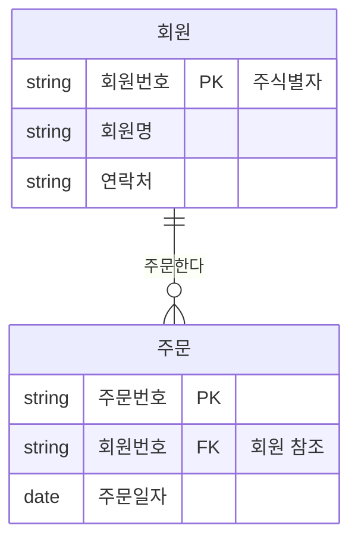
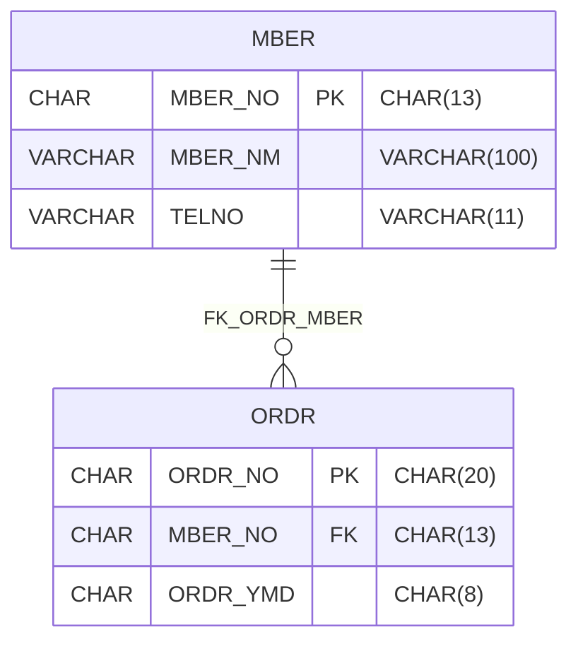

# 공공데이터베이스 산출물 관리 Skill
## 1. 목적

이 스킬은 `{요구사항번호}-db-modeling.md` 파일을 입력으로 받아 정부기관 DA 업무에서 필요한 공공데이터베이스 산출물을 **문서별 개별 xlsx 파일**(`{요구사항번호}-{문서명}.xlsx`)로 생성하고, 최종검토 시 **산출물관리대장**으로 취합한다.
생성 대상 산출물은 다음 7종이다.

1. 논리데이터모델다이어그램
2. 물리데이터모델다이어그램
3. 엔터티정의서
4. 애트리뷰트정의서
5. 데이터베이스정의서
6. 테이블정의서
7. 컬럼정의서

이 스킬은 공공데이터베이스 표준화 관리 매뉴얼의 산출물 관리 기준을 따른다. 특히 산출물 작성 시 표준용어, 표준단어, 표준도메인, 표준코드를 준수하고, 산출물 생성/변경 시 기관 메타데이터 관리시스템에 등록할 수 있도록 메타데이터 항목을 함께 준비한다.

### 1.1 사용 시점 (트리거)

다음과 같은 요청을 받으면 이 스킬을 사용한다.

- `{요구사항번호}-db-modeling.md`(데이터 모델링)를 받아 DB 산출물을 만들 때
- "데이터 산출물 생성", "DB 산출물", "ERD 작성", "엔터티/테이블/컬럼정의서 생성", "산출물관리대장", "산출물 취합"을 요청받을 때
- 논리/물리 ERD를 Mermaid로 작성하거나, 기존 산출물을 표준검토 결과에 맞춰 갱신할 때

### 1.2 경계와 에러 처리

이 스킬의 범위와 한계는 다음과 같다.

- **표준 판정은 직접 하지 않는다.** 표준용어·단어·도메인·코드 적합성 판단과 메타데이터 등록은 `metadata-agent`(metadata-standardize 스킬)에 위임하고, 그 결과를 산출물에 반영만 한다.
- **DB에 실제 반영하지 않는다.** DDL 실행, DB 접속, 메타데이터 관리시스템 등록은 범위 밖이다. 산출물 문서(xlsx) 생성·취합까지가 책임이다.
- **모델링을 새로 설계하지 않는다.** 입력 모델링.md에 없는 엔터티/속성을 임의로 만들지 않는다. 모호하면 `보완 필요`로 표기한다.
- **에러 처리**:
  - 입력 `{요구사항번호}-db-modeling.md` 부재 → 중단하고 입력 위치를 요청한다(추측 생성 금지).
  - 파싱 결과 필수 항목 누락 → 해당 산출물의 `표준검토상태`를 `보완`으로, 누락 항목을 비고에 기록한다.
  - 표준검토 미완료 → 산출물은 생성하되 `표준검토상태` 공란을 남기지 않고 `미검토`로 표기한다.

## 2. 입력
### 필수 입력
- `{요구사항번호}-db-modeling.md`

### 권장 입력

- 기관표준용어 사전
- 기관표준단어 사전
- 기관표준도메인 사전
- 기관표준코드 사전
- 공통표준용어/단어/도메인/코드 참조 파일
- 기존 DDL
- 기존 테이블정의서/컬럼정의서
- 요구사항정의서
- 화면설계서
- 인터페이스정의서
- 업무규칙정의서

## 3. Agent 협업 구조

```text
사용자
  -> da-agent
      -> `{요구사항번호}-db-modeling.md` 분석
      -> 엔터티/속성/관계/식별자 추출
      -> 논리모델 후보 생성
      -> 물리모델 후보 생성
      -> metadata-agent 표준검토 요청
          -> 표준용어 검토
          -> 표준단어 검토
          -> 표준도메인 검토
          -> 표준코드 검토
          -> 메타데이터 등록항목 검토
      -> 표준검토 결과 반영
      -> 문서별 xlsx 산출물 생성 ({요구사항번호}-{문서명}.xlsx)
      -> 최종검토 취합 ({요구사항번호}-산출물관리대장.xlsx)
```

## 4. 처리 절차

### 4.1 데이터 모델링.md 파싱

`{요구사항번호}-db-modeling.md`에서 다음 항목을 추출한다.

```text
- DB명
- 업무영역 / 주제영역
- 엔터티 목록
- 속성 목록
- 관계 목록
- 식별자 정보
- 코드성 속성
- 개인정보/민감정보 후보
- 물리 테이블명/컬럼명 후보
- 데이터 타입/길이 후보
- 업무규칙
```

### 4.2 논리모델 생성

다음 기준으로 논리모델을 생성한다.

```text
- 엔터티, 속성, 관계, 식별자를 포함한다.
- 업무규칙이 논리 모델에 반영되었는지 확인한다.
- 중복 속성, 반복 속성, 다중값 속성을 식별한다.
- 주식별자, 후보식별자, 외래식별자를 구분한다.
- 참조 관계와 관계 차수를 명시한다.
```

### 4.3 물리모델 생성

다음 기준으로 물리모델을 생성한다.

```text
- 엔터티를 테이블로 변환한다.
- 속성을 컬럼으로 변환한다.
- 표준용어 영문약어명을 기준으로 컬럼명을 생성한다.
- 표준도메인을 기준으로 데이터 타입과 길이를 결정한다.
- PK, FK, UK, Index, NOT NULL 여부를 정리한다.
- 테이블/컬럼 COMMENT 후보를 작성한다.
```

### 4.4 Mermaid ERD 작성

논리/물리 다이어그램은 **Mermaid `erDiagram` 표기법으로 작성**한다(DBML/PlantUML/CASE Tool 미사용). 작성한 Mermaid 코드는 각 다이어그램 시트의 `ERD코드` 컬럼에 그대로 저장한다.

#### 논리 ERD (한글 엔터티/속성)

- 엔터티명·속성명은 표준용어(한글)를 사용한다.
- 주식별자는 `PK`, 외래식별자는 `FK`, 후보식별자는 `UK`로 표기한다.
- 엔터티, 속성, 관계, 식별자가 모두 포함되어야 한다.



#### 물리 ERD (영문 테이블/컬럼 + 데이터타입)

- 테이블명·컬럼명은 표준용어 영문약어명을 사용한다.
- 데이터타입/길이는 표준도메인 기준으로 표기한다.
- 테이블, 컬럼, 관계, 식별자(PK/FK/UK)가 모두 포함되어야 한다.



> Mermaid 카디널리티: `||`(1, 필수), `o{`(0..N), `|{`(1..N), `o|`(0..1). 식별관계 `--`, 비식별관계 `..`.
> Mermaid 속성의 타입 토큰에는 공백·괄호·콤마를 쓸 수 없으므로 **타입 토큰은 `CHAR`/`VARCHAR` 등 타입명만** 쓰고, 정확한 타입·길이는 큰따옴표 코멘트(예: `"CHAR(13)"`)로 표기한다. 이 코멘트 값은 컬럼정의서 시트의 데이터타입·길이와 일치시킨다.

### 4.5 metadata-agent 표준검토

metadata-agent는 다음 검토를 수행한다.

```text
- 표준용어 적용 여부
- 표준단어 조합 적정성
- 표준도메인 매핑 적정성
- 표준코드 적용 필요 여부
- 공통표준/기관표준/DB표준 준용 여부
- 비표준 데이터 매핑 필요 여부
- 메타데이터 등록 필수항목 누락 여부
```

검토 결과는 `{요구사항번호}-표준검토결과.xlsx`에 기록한다.

### 4.6 문서별 xlsx 산출물 생성

산출물은 하나의 통합 파일이 아니라 **문서별 개별 xlsx 파일**로 생성한다. 파일명은 `{요구사항번호}-{문서명}.xlsx` 규칙을 따르고 `docs/04. db-deliverables/{요구사항번호}/`에 저장한다.

- `{요구사항번호}`은 입력 `{요구사항번호}-db-modeling.md`의 요구사항 식별자를 사용한다.

> **⚠️ xlsx 필수 — 마크다운 대체 금지**: da-agent는 1~3단계의 설계·표준화·검증 결과를 반영해 각 산출물을 **openpyxl로 직접 xlsx로 작성**한다. 각 파일은 `본문`+`변경이력` 시트로 구성하고, 컬럼 헤더는 [`references/column-specs.md`](references/column-specs.md)를 따른다.
> **완료 게이트**: `ls "docs/04. db-deliverables/{요구사항번호}/"*.xlsx | wc -l` ≥ 9(8종+산출물관리대장) 확인. 미달이면 누락분을 생성한다(.md로 종료 금지).

| 문서명 | 생성 파일명 |
|---|---|
| 논리데이터모델다이어그램 | `{요구사항번호}-논리데이터모델다이어그램.xlsx` |
| 물리데이터모델다이어그램 | `{요구사항번호}-물리데이터모델다이어그램.xlsx` |
| 엔터티정의서 | `{요구사항번호}-엔터티정의서.xlsx` |
| 애트리뷰트정의서 | `{요구사항번호}-애트리뷰트정의서.xlsx` |
| 데이터베이스정의서 | `{요구사항번호}-데이터베이스정의서.xlsx` |
| 테이블정의서 | `{요구사항번호}-테이블정의서.xlsx` |
| 컬럼정의서 | `{요구사항번호}-컬럼정의서.xlsx` |
| 표준검토결과 | `{요구사항번호}-표준검토결과.xlsx` |

각 파일은 `본문` 시트 1개와 `변경이력` 시트 1개로 구성한다(여러 산출물을 한 파일에 몰아넣지 않는다).

### 4.7 최종검토 취합

최종검토 단계에서 위 문서들을 **문서별로 취합하여 산출물 관리대장 1부로 통합 관리**한다. 개별 문서 파일은 그대로 두고, 취합본은 문서 목록·검토상태·등록상태를 한눈에 집계한다.

- 생성 파일: `{요구사항번호}-산출물관리대장.xlsx` (같은 폴더)
- 구성: 문서별 1행으로 산출물ID·문서명·파일명·표준검토상태(적합/보완/부적합)·메타데이터등록상태·최종검토자·검토일자·비고를 집계한다.
- 문서 하나라도 표준검토상태가 `보완`/`부적합`이면 관리대장 상단 요약에 미결로 표시한다.
- 개별 문서가 갱신되면 관리대장의 해당 행만 다시 취합한다.

## 5. 산출물 파일 구성

각 문서는 독립 xlsx 파일이며 본문 시트 + `변경이력` 시트로 구성한다.

| 산출물 파일 | 본문 시트 | 비고 |
|---|---|---|
| `{요구사항번호}-논리데이터모델다이어그램.xlsx` | 논리데이터모델다이어그램 | Mermaid 논리 ERD |
| `{요구사항번호}-물리데이터모델다이어그램.xlsx` | 물리데이터모델다이어그램 | Mermaid 물리 ERD |
| `{요구사항번호}-엔터티정의서.xlsx` | 엔터티정의서 | |
| `{요구사항번호}-애트리뷰트정의서.xlsx` | 애트리뷰트정의서 | |
| `{요구사항번호}-데이터베이스정의서.xlsx` | 데이터베이스정의서 | |
| `{요구사항번호}-테이블정의서.xlsx` | 테이블정의서 | |
| `{요구사항번호}-컬럼정의서.xlsx` | 컬럼정의서 | |
| `{요구사항번호}-표준검토결과.xlsx` | 표준검토결과 | metadata-agent 검토 결과 |
| `{요구사항번호}-산출물관리대장.xlsx` | 산출물관리대장 | **최종검토 취합본** |

## 6. 산출물별 필수 컬럼

각 산출물 `본문` 시트의 **상세 필수 컬럼 정의는 [`references/column-specs.md`](references/column-specs.md)** 에 분리해 두었다(본문 토큰 절약). 산출물을 생성·검토할 때 해당 파일을 로드해 컬럼 헤더를 맞춘다. 요약은 다음과 같다.

| 산출물 | 핵심 필수 컬럼 (요약) |
|---|---|
| 논리데이터모델다이어그램 | 다이어그램ID · 한글DB명 · 주제영역 · ERD표기법 · ERD코드 · 포함요소 · 표준검토상태 |
| 물리데이터모델다이어그램 | 다이어그램ID · 한글DB명 · DBMS · ERD표기법 · ERD코드 · 포함요소 · 표준검토상태 |
| 엔터티정의서 | 한글DB명 · 주제영역 · 엔터티명 · 엔터티설명 · 주식별자 · 개인정보포함여부 · 표준검토상태 |
| 애트리뷰트정의서 | 엔터티명 · 속성명 · 식별자여부 · 표준용어명 · 표준도메인명 · 표준검토상태 |
| 데이터베이스정의서 | 기관명 · 한글DB명 · 영문DB명 · DBMS정보 · DB형태 · 메타데이터등록상태 |
| 테이블정의서 | 한글테이블명 · 영문테이블명 · 주식별자 · 관련엔터티명 · 개인정보포함여부 · 표준검토상태 |
| 컬럼정의서 | 한글컬럼명 · 영문컬럼명 · 데이터타입 · 데이터길이 · 식별자여부 · 표준용어명 · 표준도메인명 · 표준코드명 · 표준검토상태 |
| 산출물관리대장 | 산출물ID · 문서명 · 파일명 · 표준검토상태 · 메타데이터등록상태 · 최종검토자 · 검토일자 |

## 7. 표준검토 규칙

metadata-agent는 다음 기준으로 산출물을 검토한다.

```text
1. 공통표준 또는 기관표준에 동일 의미의 표준용어가 있는지 확인한다.
2. 속성명과 컬럼명은 표준용어명 및 표준용어 영문약어명을 우선 적용한다.
3. 데이터 타입과 길이는 표준도메인을 기준으로 적용한다.
4. 코드성 속성은 표준코드 또는 행정표준코드 적용 가능성을 검토한다.
5. 동일 의미의 비표준 컬럼명은 표준용어로 매핑한다.
6. ERD, 정의서, DDL, 메타데이터 등록항목 간 불일치를 검토한다.
7. 생성/변경된 산출물은 메타데이터 관리시스템 등록 대상인지 확인한다.
```

## 8. 출력 품질 기준

```text
- 모든 시트는 헤더를 포함한다.
- 필수 항목이 비어 있으면 표준검토결과에 보완 필요로 기록한다.
- 논리/물리 ERD는 Mermaid `erDiagram` 표기법으로 작성한다.
- 논리 ERD에는 엔터티, 속성, 관계, 식별자가 포함되어야 한다.
- 물리 ERD에는 테이블, 컬럼, 관계, 식별자가 포함되어야 한다.
- 애트리뷰트명은 표준용어를 사용한다.
- 컬럼명은 표준용어 영문약어명 기준으로 작성한다.
- 컬럼 타입/길이는 표준도메인 기준으로 작성한다.
- 표준검토결과 문서에는 검토대상, 검토항목, 결과, 보완권고를 기록한다.
- 산출물은 문서별 개별 xlsx(`{요구사항번호}-{문서명}.xlsx`)로 생성하고, 최종검토 시 `{요구사항번호}-산출물관리대장.xlsx`로 취합한다.
```

## 9. Codex 실행 프롬프트 예시

```text
너는 정부기관 DA Agent다.
입력된 데이터 모델링.md 파일을 분석하여 공공데이터베이스 산출물을 문서별 개별 xlsx로 생성하라.

처리 순서:
1. 데이터 모델링.md에서 DB명, 엔터티, 속성, 관계, 식별자, 테이블, 컬럼, 데이터 타입, 업무규칙을 추출한다.
2. 논리데이터모델다이어그램과 물리데이터모델다이어그램을 Mermaid erDiagram 코드로 작성한다.
3. 엔터티정의서, 애트리뷰트정의서, 데이터베이스정의서, 테이블정의서, 컬럼정의서를 생성한다.
4. metadata-agent를 호출했다고 가정하고 표준용어, 표준단어, 표준도메인, 표준코드 적용 여부를 검토한다.
5. 표준검토 결과를 {요구사항번호}-표준검토결과.xlsx에 기록한다.
6. 각 문서를 {요구사항번호}-{문서명}.xlsx로 개별 저장한다(docs/04. db-deliverables/{요구사항번호}/).
7. 최종검토 시 모든 문서를 {요구사항번호}-산출물관리대장.xlsx로 취합한다.

반드시 다음 문서를 각각 개별 xlsx로 생성한다:
논리데이터모델다이어그램, 물리데이터모델다이어그램, 엔터티정의서, 애트리뷰트정의서, 데이터베이스정의서, 테이블정의서, 컬럼정의서, 표준검토결과.
그리고 최종검토 취합본으로 산출물관리대장을 생성한다.
```

## 10. 참고 문서

- [`references/column-specs.md`](references/column-specs.md) — 산출물별 상세 필수 컬럼 정의
