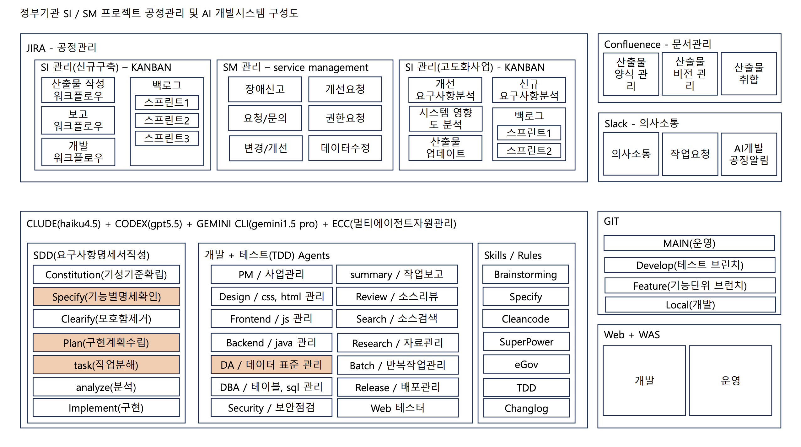
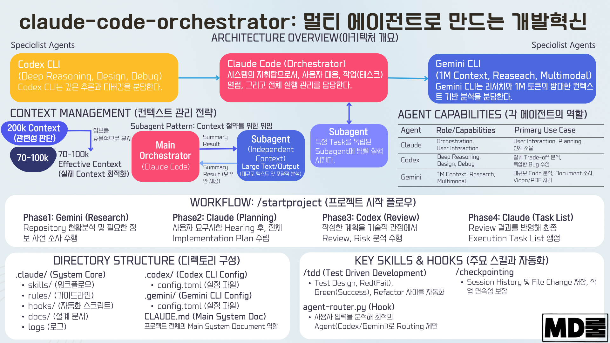
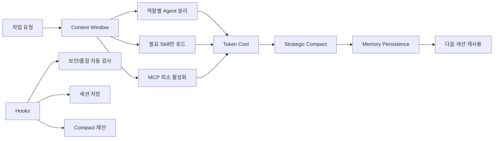
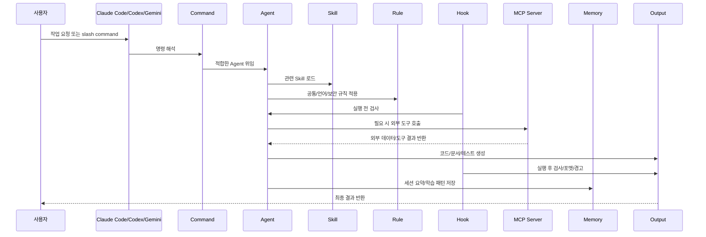
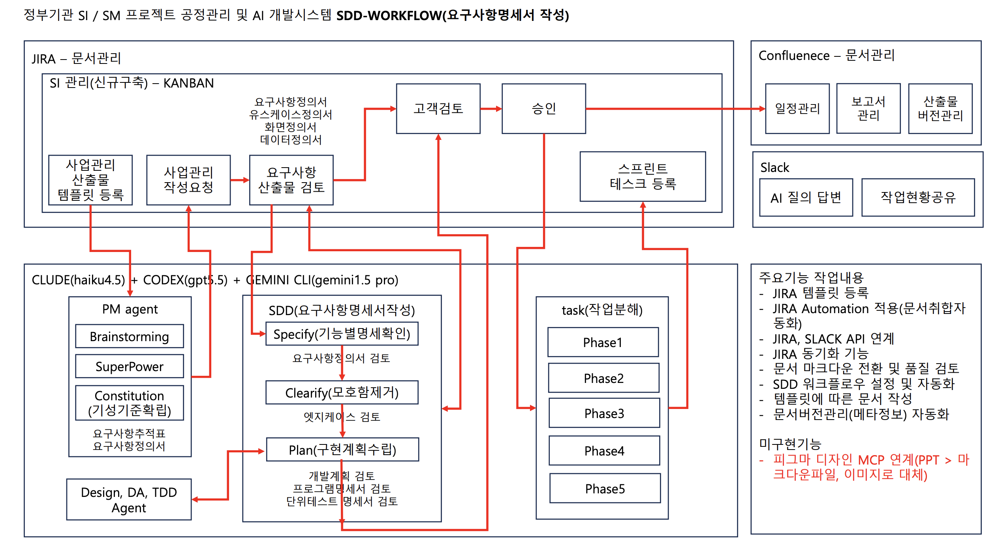
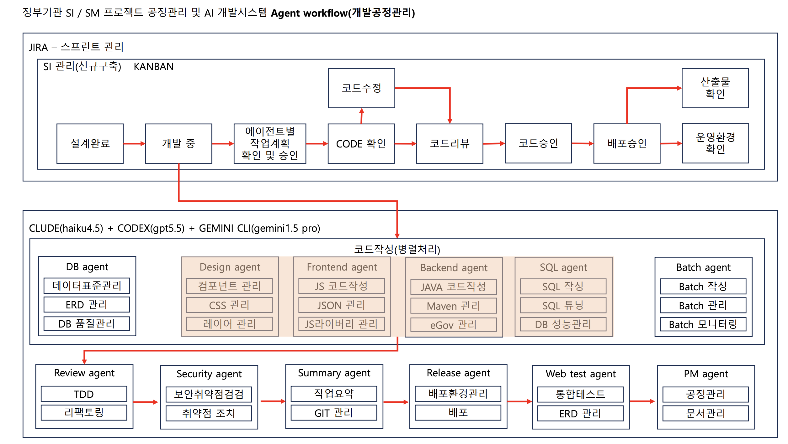

# 클로드 하네스 활용을 통한 전자정부프레임워크 관리 최적화

## 1. 목적

공공기관 SI 프로젝트 수행 과정에서 반복적으로 발생하는 **문서 품질 저하, 요구사항 추적성 단절, 공정률 왜곡, 산출물 취합 지연, 개발 품질 저하** 문제를 개선하기 위해, Jira·Confluence·Slack·Claude 등 AI 기반 협업 도구를 활용한 프로젝트 관리 및 개발 최적화 방안을 체계를 수립하는데 목적이 있다.

특히 공공기관 프로젝트는 전체 공정의 상당 부분이 **사업관리 및 개발 산출물 작성·검토·취합**에 집중되어 있으며, 감리·검수 단계에서 산출물 품질과 요구사항 추적성이 주요 점검 대상이 된다. 이에 따라 AI를 단순 코딩 보조 도구로 활용하는 수준을 넘어, **프로젝트 전 공정의 역할·룰·스킬를 표준화하고 자동화하는 업무 혁신 체계를 수립**하고자 한다.

---

## 2. 추진 배경

공공기관 프로젝트는 전통적으로 폭포수 모델 중심으로 운영되어 왔으며, 요구사항 정의, 분석, 설계, 개발, 테스트, 감리, 검수 단계가 순차적으로 진행된다. 그러나 실제 수행 과정에서는 다음과 같은 문제가 반복적으로 발생한다.

첫째, 산출물 작성과 취합이 수작업 중심으로 이루어져 문서 품질 확보에 많은 시간이 소요된다. 
둘째, 요구사항 추적관리가 최초 작성 시점에는 이루어지지만, 개발과 테스트가 진행되면서 지속적으로 유지되지 않는다. 
셋째, 주간보고와 월간보고 작성 시 WBS, 이슈, 산출물, 결함, 개발 진행률을 별도 담당자가 수작업으로 취합하고 있다. 
넷째, 요구사항이 불명확하거나 테스트 기준이 부족한 상태에서 개발이 진행되면 오픈 시점에 다수의 오류가 발생하고, 이후 긴급 수정과 재작업 비용이 증가한다.
다섯째, 공공기관 특성상 폭포수 방식이 강하게 적용되어 개발 완료 후 품질 문제가 집중적으로 드러나는 구조가 발생한다.

## 3. 추진 방향
본 프로젝트 관리 최적화의 핵심 방향은 다음과 같다.
```text
문서관리 자동화 → 요구사항 추적관리 자동화 → 공정관리 자동화 → SDD + TDD 기반 요구사항작성 → AI 기반 역할·룰·스킬 정착 → 전자정부표준프레임워크 최적화 개발 → 배포 →  통합테스트 → 산출물작성
```

이를 위해 Jira, Confluence, Slack, Claude를 기본 협업 도구로 활용하고, 필요 시 Spec Kit, Claude Code, 기타 AI CLI 도구를 도입하여 프로젝트 관리와 개발 수행 전반에 AI 자동화 체계를 적용한다.

---

## 4. 주요 개선 목표
### 4.1 문서 품질 확보
정부기관 프로젝트는 사업관리 및 개발 산출물 관리 비중이 높으며, 산출물 품질은 감리·검수 대응의 핵심 요소이다.

| 구분    | 기존 방식            | 개선 방식                                 |
| ----- | ---------------- | ------------------------------------- |
| 문서 작성 | 담당자별 개별 작성       | Confluence 표준 템플릿 기반 작성               |
| 문서 취합 | PM/문서 담당자 수작업 취합 | Jira/Confluence 기반 자동 취합              |
| 문서 검토 | 개별 검토 의견 관리      | Claude 기반 누락/불일치 검토                   |
| 버전 관리 | 파일명 중심 관리        | Confluence Page + Attachment + 기준선 관리 |
| 보고 자료 | 수작업 복사/정리        | 자동 보고서 초안 생성                          |

기대 효과는 산출물 취합 및 검토 시간을 단축하고, 감리·검수 단계에서 문서 품질 관련 리스크를 사전에 줄이는 것이다.

---

### 4.2 요구사항 추적관리 강화

공공기관 프로젝트에서는 요구사항 ID를 기준으로 유스케이스, 화면, API, 프로그램, 테이블, 테스트케이스까지 추적해야 한다. 단계별 산출물 간 ID 연결이 유지되지 않아 감리 시 많은 시간을 소요한다.

개선 방향은 다음과 같다.
```text
요구사항추적표를 기준으로 jira 필드에 다음사항을 추가하여 집중관리한다.
요구사항 ID → 유스케이스 ID → 화면 ID → API ID → 프로그램 ID → 테이블 ID → 테스트케이스 ID → 결함 ID → 검수 승인 ID
```

AI를 활용하여 기존 문서의 요구사항 ID 연결 상태를 자동 점검하고, 누락되거나 불일치한 항목을 식별하여 Jira와 Confluence 문서에 자동 업데이트한다.
| 관리 항목   | 개선 내용                            |
| ------- | -------------------------------- |
| 요구사항 누락 | Claude가 요구사항정의서와 유스케이스정의서 비교     |
| ID 불일치  | 문서 간 요구사항 ID, 테스트케이스 ID 연결 점검    |
| 변경 반영   | 변경된 요구사항을 관련 설계·테스트 문서에 반영       |
| 감리 대응   | 요구사항 추적표 자동 생성 및 최신화             |
| 보완 요청   | Jira Sub-task 또는 댓글로 담당자에게 보완 요청 |

이를 통해 감리 지적 가능성을 줄이고, 요구사항 변경에 따른 설계·개발·테스트 영향도를 체계적으로 관리할 수 있다.

---

### 4.3 공정관리 자동화

현재 주간보고, 월간보고 작성 시 WBS, Jira 이슈, 산출물 현황, 개발 진행률, 결함 현황을 별도 담당자가 수작업으로 취합하고 있다. 이 과정은 반복적이고 시간이 많이 소요되며, 개발자의 주관적 보고에 따라 공정률이 왜곡될 수 있다.

개선 방향은 기존의 “개발자 보고 기반 공정률”을 “TDD 통과 기준 기반 공정률”로 전환하는 것이다.

| 기존 공정률 기준      | 개선 공정률 기준                        |
| -------------- | -------------------------------- |
| 개발자 주관적 진행률 입력 | Jira Task 완료 상태                  |
| PM 수작업 취합      | Jira 자동 집계                       |
| 산출물 별도 확인      | Confluence Page Properties 기반 취합 |
| 테스트 결과 수동 확인   | TDD/테스트 통과 여부 기반 확인              |
| 보고서 수작업 작성     | AI 기반 주간·월간보고 자동 생성              |

공정률 산정 기준 예시는 다음과 같다.

```text
요구사항 명세 완료: 10% > 설계 문서 승인: 20% > 테스트케이스 작성 완료: 30% > TDD 테스트 작성 완료: 40% > 단위 테스트 통과: 60% > 통합 테스트 통과: 80% > 고객 검토 및 승인: 100%
```
이를 통해 허위 보고 가능성을 줄이고, 실제 산출물과 테스트 결과에 기반한 객관적 공정관리가 가능해진다.

---

### 4.4 개발 자동화 및 품질 향상

정확한 요구사항 명세를 입력으로 사용하여 Claude Code, Spec Kit, AI CLI 도구를 통해 기능 구현과 테스트를 자동화한다. 개발 자동화의 핵심은 단순 코드 생성이 아니라, 다음 흐름을 정착시키는 것이다.

```text
요구사항정의서 → 유스케이스정의서 → 화면정의서 → 테이블정의서 → Spec 작성 → Plan 작성 → TDD 작성 → Task 분해 → 코드 구현 → 테스트 통과 → 산출물 업데이트
```
이를 통해 개발자는 반복적인 보일러플레이트 코드 작성보다 요구사항 검증, 예외 처리, 품질 개선에 집중할 수 있다.

### 4.5 애자일 프로젝트 정착

공공기관 프로젝트는 폭포수 모델 기반으로 수행되는 경우가 많아 개발 후반부 또는 오픈 시점에 다수의 오류가 집중적으로 발견된다. 공공기관의 공식 산출물 체계는 유지하되, 내부 개발 프로세스는 애자일 방식으로 전환하여 품질과 대응 속도를 높인다.


| 기존 방식         | 개선 방식          |
| ------------- | -------------- |
| 전체 설계 후 일괄 개발 | 요구사항 단위 점진 개발  |
| 오픈 시점 오류 집중   | 프로토타입 기반 조기 검증 |
| 문서와 개발 분리     | 문서·테스트·코드 연계   |
| 테스트 후행        | TDD 기반 테스트 선행  |
| 고객 피드백 지연     | 반복 검토 및 보완     |

---

## 5. AI 기반 업무 혁신 방향

본 과제의 핵심은 AI CLI 도구를 활용해 코딩만 자동화하는 것이 아니다. 프로젝트 공정에서 발생하는 역할별 룰과 워크플로우를 정리하고, AI가 이를 수행하거나 보조할 수 있도록 체계화하는 것이다.

AI 적용 대상은 다음과 같다.

| 영역     | AI 활용 방안                       |
| ------ | ------------------------------ |
| 문서관리   | 산출물 템플릿 생성, 누락 검토, 문서 비교       |
| 요구사항관리 | 요구사항 체계화, ID 추적, 변경 영향도 분석     |
| 공정관리   | Jira Task 기반 공정률 산정, 보고서 자동 생성 |
| 개발관리   | Spec 기반 구현 계획, TDD, 코드 생성      |
| 테스트관리  | 테스트케이스 생성, 테스트 누락 점검           |
| 감리대응   | 요구사항 추적표, 산출물 현황, 보완사항 정리      |
| 운영관리   | 이슈 요약, 장애보고서, FAQ, 조치 이력 지식화   |

---

## 6. 목표 시스템 구성


---

## 7. 핵심 아키텍처



---

### 7.1 ECC 자원관리

---

### 7.2 ECC Workflow




---

## 전자정부프레임워크 특화 시스템 구성
### 8.1 사업관리



---

### 8.2 개발공정관리



---

### 8.3 프로젝트 구성도

```text
egov-ecc/
├─ agents/orchaorcahestrator
│  ├─ pm-agent.md
│  ├─ biz-management-agent.md
│  ├─ egov-architecture.md
│  ├─ egov-DB-agent.md
│  ├─ egov-design-agent.md
│  ├─ egov-developer-agent.md
│  ├─ reviewer.md
│  ├─ deployer.md
│  └─ qa-agent.md
│
├─ skills/
│  ├─ egov-document-template/
│  ├─ egov-requirement-analysis/
│  ├─ egov-framework-patterns/
│  ├─ egov-menu-auth-check/
│  ├─ egov-server-security/
│  ├─ egov-test-scenarios/
│  ├─ realtime-meeting-minutes/
│  ├─ SDD/
│  ├─ ECC/
│  └─ ETC..
│
├─ commands/
│  ├─ egov-plan.md
│  ├─ egov-generate-code.md
│  ├─ egov-security-check.md
│  ├─ egov-menu-auth-check.md
│  ├─ egov-meeting-close.md
│  └─ egov-acceptance-doc.md
│
├─ rules/(egov-wiki 기반 작성 지침 생성)
│  ├─ common-base-rule.md
│  ├─ screen-processing-rule.md
│  ├─ business-processing-rule.md
│  ├─ data-processing-rule.md
│  ├─ integration-rule.md
│  ├─ batch-rule.md
│  └─ security-rule.md
│
├─ hooks/
│  ├─ before-submit-secret-check.json
│  ├─ after-file-edit-format.json
│  ├─ suggest-compact.json
│  └─ session-memory.json
│
├─ mcp-configs/
│  ├─ github.json
│  ├─ jira.json
│  ├─ confluence.json
│  ├─ figma.json
│  ├─ slack.json
│  ├─ db-readonly.json
│  └─ playwright.json
│
├─ docs/
│  ├─ reference/
│  └─ workspace/
│
├─ run/
│
└─ outputs/
   ├─ jira/
   ├─ confluence/
   ├─ meeting-minutes/
   ├─ test-results/
   └─ acceptance-docs/
```

```text
src/main/webapp/WEB-INF/jsp/egovframework/let/<domain>/<module>/
├── Egov<Module>List.jsp
├── Egov<Module>Regist.jsp
├── Egov<Module>Detail.jsp
└── Egov<Module>Updt.jsp

src/main/java/egovframework/let/<domain>/<module>/
├── web/
│   └── Egov<Module>Controller.java
├── service/
│   ├── Egov<Module>Service.java
│   ├── <Module>VO.java
│   └── <Module>.java
└── service/impl/
    ├── Egov<Module>ServiceImpl.java
    └── <Module>DAO.java

src/test/java/egovframework/let/<domain>/<module>/
├── web/Egov<Module>ControllerTest.java
├── service/Egov<Module>ServiceTest.java
└── service/impl/<Module>DAOTest.java

```


---

## 9. 담당자별 역할

<table style="font-size: 0.8em; width: 100%; border-collapse: collapse; margin: 0; padding: 0;">
<tr>
  <th style="width: 5%; padding: 2px; text-align: left;">담당</th>
  <th style="width: 5%; padding: 2px; text-align: left;">역할</th>
  <th style="width: 90%; padding: 2px; text-align: left;">주요 내용</th>
</tr>
<tr>
  <td rowspan="4" style="padding: 2px;"><b>신대원</b></td>
  <td style="padding: 2px;">AI 툴 관리</td>
  <td style="padding: 2px;">Jira, Confluence, Slack, Claude 도입 및 AI 도구 관리</td>
</tr>
<tr>
  <td style="padding: 2px;">에이전트·룰·스킬 관리</td>
  <td style="padding: 2px;">AI 설정, 프롬프트 규칙, 에이전트 룰, 스킬 관리</td>
</tr>
<tr>
  <td style="padding: 2px;">전자정부프레임워크 테스트</td>
  <td style="padding: 2px;">전자정부프레임워크 기반 코딩 자동화 테스트 수행</td>
</tr>
<tr>
  <td style="padding: 2px;">추진 총괄</td>
  <td style="padding: 2px;">AI 기반 프로젝트 관리 최적화 방향 수립 및 성과 관리</td>
</tr>
<tr>
  <td rowspan="4" style="padding: 2px;"><b>윤지혜</b></td>
  <td style="padding: 2px;">문서관리 전략 수립</td>
  <td style="padding: 2px;">정부기관 문서 템플릿 등록 및 산출물 관리 체계 수립</td>
</tr>
<tr>
  <td style="padding: 2px;">Jira/Confluence/Slack 문서관리</td>
  <td style="padding: 2px;">문서 작성·검토·취합 전략 수립</td>
</tr>
<tr>
  <td style="padding: 2px;">공정관리 자동화</td>
  <td style="padding: 2px;">Jira Task 취합 및 주간·월간 보고서 자동 생성</td>
</tr>
<tr>
  <td style="padding: 2px;">산출물 품질관리</td>
  <td style="padding: 2px;">산출물 누락, 검토·승인 상태 관리</td>
</tr>
<tr>
  <td rowspan="4" style="padding: 2px;"><b>강호일</b></td>
  <td style="padding: 2px;">에이전트 최적화</td>
  <td style="padding: 2px;">KOMSA 개발환경 맞춤 공통기능, 솔루션, API 지원</td>
</tr>
<tr>
  <td style="padding: 2px;">개발환경 표준화</td>
  <td style="padding: 2px;">개발환경, 공통 모듈, API 명세 정리</td>
</tr>
<tr>
  <td style="padding: 2px;">업무 테스트</td>
  <td style="padding: 2px;">해수호봇, RCMS 업무 AI 에이전트 성능 검증</td>
</tr>
<tr>
  <td style="padding: 2px;">기술 검증</td>
  <td style="padding: 2px;">생성 코드 품질, 테스트 통과율, 생산성 검증</td>
</tr>
<tr>
  <td rowspan="4" style="padding: 2px;"><b>박상원</b></td>
  <td style="padding: 2px;">컴포넌트 최적화</td>
  <td style="padding: 2px;">KOMSA 화면 패턴 분석 및 컴포넌트 명세 설정</td>
</tr>
<tr>
  <td style="padding: 2px;">화면 패턴 표준화</td>
  <td style="padding: 2px;">반복 화면, 공통 UI, 입력/조회/상세/승인 패턴 정리</td>
</tr>
<tr>
  <td style="padding: 2px;">업무 테스트</td>
  <td style="padding: 2px;">운항관리, 항만보안심사 업무 AI 에이전트 성능 검증</td>
</tr>
<tr>
  <td style="padding: 2px;">산출물 연계</td>
  <td style="padding: 2px;">화면정의서, 컴포넌트정의서, 테스트케이스 연결 검증</td>
</tr>
</table>

---

## 10. 단계별 추진 계획

| 항목            | 내용                                          |
| ------------- | ------------------------------------------- |
| 도구 구성         | Jira, Confluence, Slack, Claude 기본 환경 구성    |
| 문서 템플릿        | 정부기관 산출물 템플릿 등록                             |
| Jira 구조       | 프로젝트, Issue Type, Workflow, Custom Field 설계 |
| Confluence 구조 | 산출물 Page Tree 및 AI Context 영역 구성            |
| Slack 채널      | 문서 요청, 검토, 보고, 개발, 이슈 채널 구성                 |

---

## 14. 임원 의사결정 요청사항

본 과제 추진을 위해 다음 사항에 대한 의사결정이 필요하다.

| 요청사항     | 내용                                               |
| -------- | ------------------------------------------------ |
| 도구 사용 승인 | Jira, Confluence, figma, Claude 및 필요 AI 도구 사용 승인 |
| 시범 적용 승인 | 해수호봇, RCMS, 운항관리, 항만보안심사 대상 시범 적용           |
| 컴포넌트 정의서 | figma를 활용한 화면레이아웃등. 전반적 디자인 지침 필요 ex)범정부 UI/UX가이드 |

---

## 15. 결론

AI 기반 프로젝트 관리 최적화는 단순히 개발자가 AI로 코드를 생성하는 수준의 도입이 아니다. 공공기관 프로젝트의 핵심 리스크인 **문서 품질, 요구사항 추적성, 공정률 정확성, 개발 품질, 감리 대응력**을 개선하기 위한 프로젝트 수행 방식의 전환이다.

Jira, Confluence, Slack, Claude를 중심으로 프로젝트 역할과 워크플로우를 표준화하고, ECC, Spec Kit 및 AI CLI 도구를 활용하여 요구사항 분석, 계획 수립, TDD, 작업 분해, 보고서 생성까지 자동화하면 다음 효과를 기대할 수 있다.

```text
문서 품질 향상
요구사항 추적성 강화
공정관리 정확도 향상
보고 업무 시간 단축
개발 품질 향상
감리 및 검수 대응력 강화
AI 기반 업무혁신 체계 정착
```
