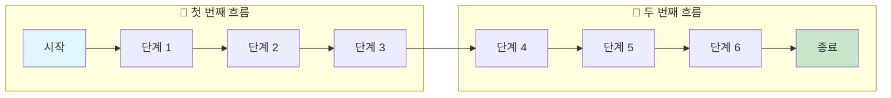

```mermaid
flowchart LR
    subgraph row1["📍 첫 번째 흐름"]
        A[시작] --> B[단계 1] --> C[단계 2] --> D[단계 3]
    end
    
    subgraph row2["📍 두 번째 흐름"]
        E[단계 4] --> F[단계 5] --> G[단계 6] --> H[종료]
    end
    
    D --> E
    
    style A fill:#e1f5ff
    style H fill:#c8e6c9
```
